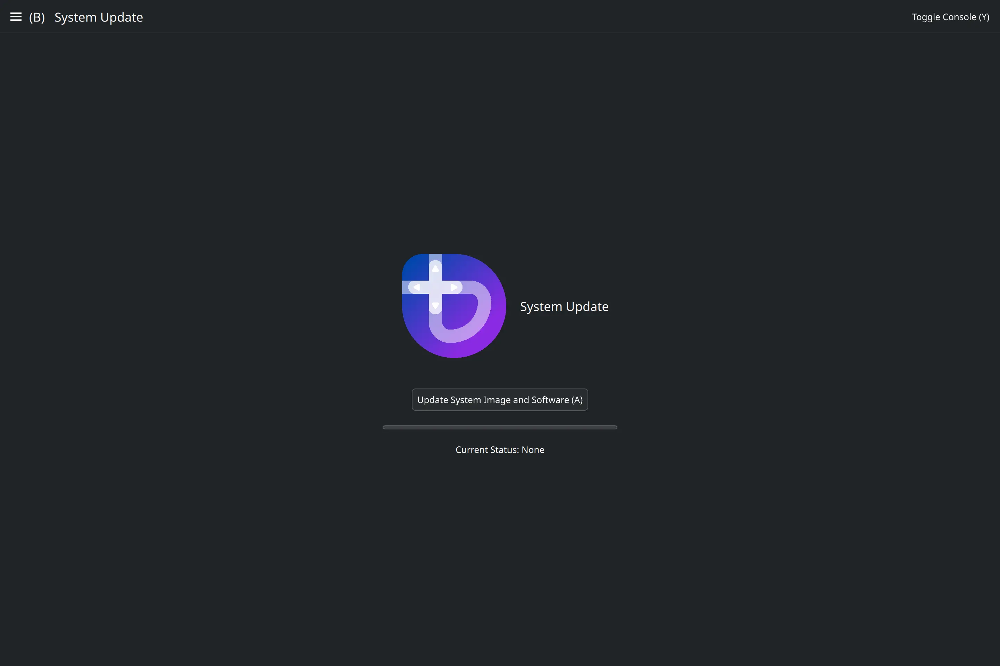

<h1>Bazzite Updater</h1>

<h2 align="center">A Graphical Frontend for the updating and rebasing tools used by Universal Blue.</h2>



<h1 align="center">Features</h1>

<p>This is a convenient, easy-to-use interface for updating your Universal Blue system.</p>

- Simple by default, with advanced features still present
- Full touchscreen support through Kirigami
- Full controller support through SDL3

<br>

<h1 align="center">Requirements</h1>

This GUI is only useful if you have `uupd` installed. If you are using a Universal Blue based system, you almost certainly do!

- https://github.com/ublue-os/uupd

<br>

<h1 align="center">Where to Install the Latest Release</h1>

This interface is still in its early stages, so I have not made it incredibly simple to install yet. If you know how, you can manually compile it or install the flatpak from the flatpak manifest.

- https://github.com/rfrench3/bazzite_updater/releases

<br>

<h1 align="center">License</h1>

<p>GPL-2.0-or-later. See LICENSE for details.</p>

<br>

<h1 align="center">Developer Instructions</h1>

I develop this project primarily in an Arch Linux distrobox. These are the instructions I use to recreate it:
```
// in distroshelf, use dockers arch latest with init system and custom home directory

IN THE BASHRC:
    export XDG_CURRENT_DESKTOP=KDE
    export PATH="$HOME/.local/bin:$PATH"

sudo pacman -Sy --noconfirm plasma-integration kdevelop kapptemplate astyle cmake git extra-cmake-modules systemd

plasma-apply-desktoptheme breeze-dark

sudo rm /usr/bin/flatpak

cd ~
curl 'https://invent.kde.org/sdk/kde-builder/-/raw/master/scripts/initial_setup.sh?ref_type=heads' > initial_setup.sh
bash initial_setup.sh

kde-builder --generate-config

kde-builder --install-distro-packages # Requires a user input
```
