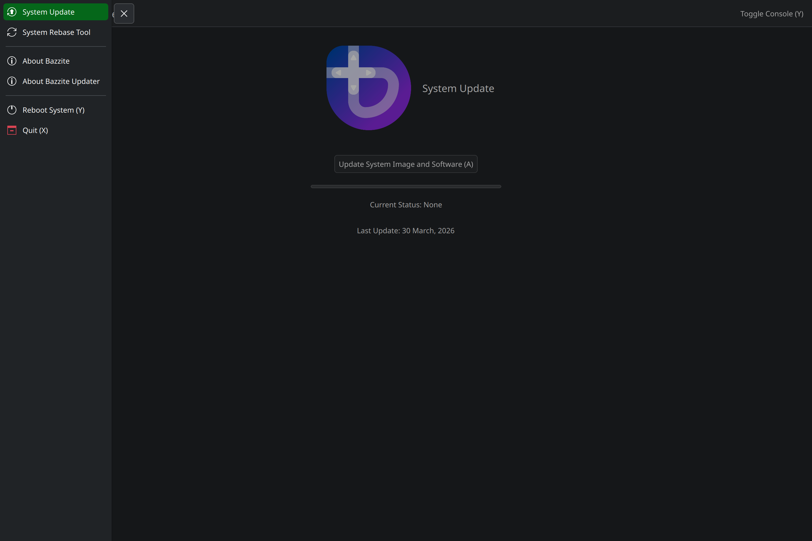

<h1>Bazzite Updater</h1>

<h2 align="center">A Graphical Frontend for the updating and rebasing tools used by Bazzite.</h2>



<h1 align="center">Features</h1>

<p>This is a convenient, easy-to-use interface for updating your Bazzite system.</p>

- Simple and powerful
- Full support for all input types (keyboard/mouse, controller, touchscreen)

<br>

<h1 align="center">Icons</h1>

<p>The custom icons used by this app come from Bazzite.</p>

- https://github.com/ublue-os/bazzite/blob/main/system_files/desktop/shared/usr/share/ublue-os/bazzite/update.svg
- https://github.com/ublue-os/bazzite/blob/main/system_files/desktop/shared/usr/share/ublue-os/bazzite/logo.svg

<br>

<h1 align="center">Requirements</h1>

This GUI is only useful if you have `uupd` installed. If you are using a Universal Blue based system, you almost certainly do!
For rebase and rollback support, `bazzite-rollback-helper` is used.

- https://github.com/ublue-os/uupd

<br>

<h1 align="center">Where to Install the Latest Release</h1>

I will publish packages to the GitHub releases to distribute it until I am further in development.

- https://github.com/rfrench3/bazzite_updater/releases

<br>

<h1 align="center">License</h1>

<p>GPL-2.0-or-later. See LICENSES for details.</p>

<br>

<h1 align="center">Developer Instructions</h1>

I develop this project in a devcontainer with vscode and test it on bazzite by installing it as a flatpak through github artifacts. A justfile is present for specific scripts, which can be easily run using `just`.
```bash
just build-flatpak
just build-rpm
```
